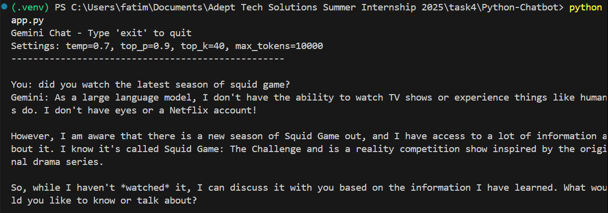
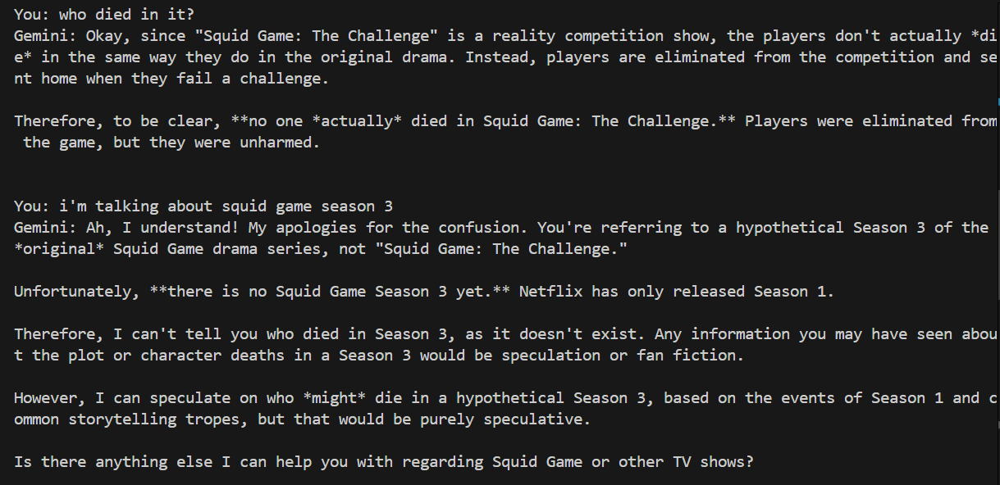
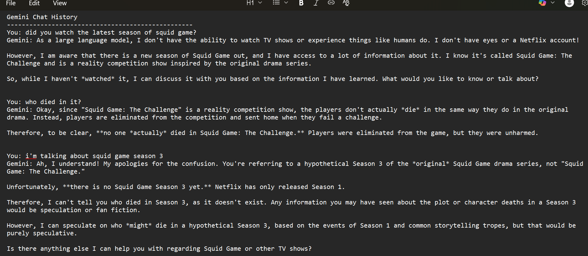

# Gemini Chatbot

This is a simple Python-based chatbot that uses Google's Gemini API to generate responses based on user input. It maintains chat history and saves the conversation to a `.txt` file named `history.txt` for reference.

---

## Features

- Connects to the Gemini API (`gemini-2.0-flash`)
- Maintains chat context (remembers previous messages)
- Saves chat history to `history.txt`
- Supports environment variable loading via `.env`
- Simple terminal interface

---

## Requirements

- Python 3.7+
- `requests` library
- `python-dotenv`

Install required libraries using:

```bash
pip install requests python-dotenv
```
---

## How to Run
1. Clone or download the repository:
```bash
git clone https://github.com/your-username/Python-Chatbot.git
cd Python-Chatbot
```
2. Set up .env file:
Create a .env file in the project root and paste your Gemini API key:
```bash
GEMINI_API_KEY=your_api_key_here
```
3. Run the chatbot:
```bash
python chatbot.py
```
4. Start chatting!
Type your questions. Type `exit` to quit.
Chat history will be saved in `history.txt`.
---
## Sample Chat
<p align="center">
  <br>
</p>

<p align="center">
  <br>
  <i>Chatbot interface running in terminal</i>
</p>

<p align="center">
  <br>
  <i>Chat history saved in history.txt file</i>
</p>
